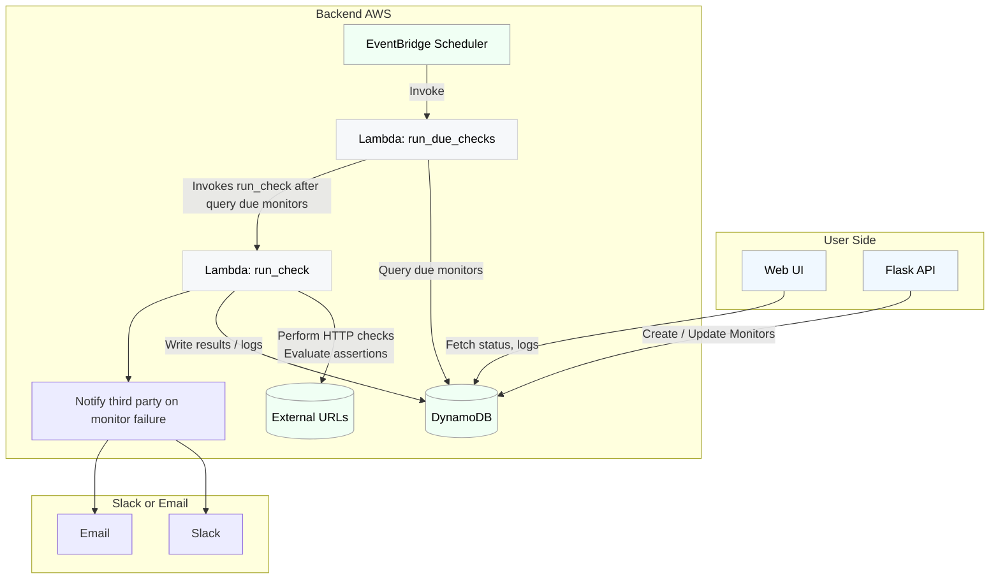

# Model

## Project
The `Project` model represents a logical grouping for uptime monitors.

| Field | Type | Description |
|---|---|---|
| `id` | `uuid` | Partition key, unique identifier for the project. |
| `name` | `str` | Name of the project. |

**Here is an example of what it could look like:**

| id | name |
|----|------|
| `a1k9...` | "App 1" |
| `b45d...` | "App 2" |

## UptimeMonitor
The `UptimeMonitor` model defines a specific URL to be monitored and its associated configuration.

| Field | Type | Description |
|---|---|---|
| `project_id` | `uuid` | Partition key, links to the `Project` it belongs to. |
| `slug` | `str` | Sort key, unique identifier for the monitor within a project. Functions as a name as well. URL safe. |
| `state` | `enum` | Current state of the monitor (`new`, `up`, `down`, `paused`). |
| `url` | `str` | The URL to be monitored. |
| `frequency_mins` | `int` | How often the monitor should run, in minutes (minimum 1 minute due to scheduler precision). |
| `next_due_at` | `str` | UTC timestamp (ISO format string) when the next check is due. |
| `timeout_secs` | `int` | Timeout for the HTTP request in seconds. |
| `assertions` | `map` | Defines conditions to check against the HTTP response (e.g., `response.time`, `response.code`). Structure varies by field. Refer to Cronitor for available fields. |
| `failures_before_alerting` | `int` | Number of consecutive failures before an alert is triggered. |
| `alert_slack_channels` | `list<str>` | List of Slack channels to send alerts to. |
| `alert_emails` |`list<str>` | List of email addresses to send alerts to. |
| `realert_interval_mins` | `int` | Minimum time in minutes between consecutive alerts for the same issue. |

#### **Here is an example of what it could look like:**

| project_id | slug | state | url | frequency_mins | next_due_at | timeout_secs | assertions | failures_before_alerting | alert_slack_channels | alert_emails | realert_interval_mins |
|------------|------|-------|-----|----------------|-------------|--------------|------------|-------------------------|---------------------|--------------|----------------------|
| `a1k9...` | `homepage-check` | `up` | `https://example.com/home-page` | 5 | `2025-11-10T20:35:00Z` | 30 | `{"response.code": 200, "response.time": {"$lt": 2000}}` | 3 | `["#alerts", "#ops"]` | `["ops@example.com"]` | 60 |
| `a1k9...` | `api-health` | `down` | `https://api.example.com/health` | 1 | `2025-11-10T20:40:00Z` | 10 | `{"response.code": 200}` | 1 | `["#critical"]` | `["oncall@example.com"]` | 30 |
| `b45d...` | `login-endpoint` | `paused` | `https://app.example.com/login` | 10 | `2025-11-10T20:45:00Z` | 15 | `{"response.code": {"$in": [200, 302]}}` | 2 | `[]` | `[]` | 120 |

TODO: Assertions have yet to be fully planned out. Once they are (matching Cronitor), we should add some docs here.

## UptimeLog
The `UptimeLog` model stores the results of each individual uptime check.

| Field | Type | Description |
|---|---|---|
| `monitor_id` | `uuid` | Partition key, links to the `UptimeMonitor` this log belongs to. |
| `timestamp` | `str` | Sort key, UTC ISO timestamp. |
| `status` | `enum` | Result of the check (`up` or `down`). |
| `resp_code` | `int` | HTTP response code received. |
| `latency_secs` | `float` | Latency of the HTTP request in seconds (can represent milliseconds, as DynamoDB numbers are floats). |

**Here is an example of what it could look like:**

| monitor_id | timestamp | status | resp_code | latency_secs |
|------------|-----------|--------|-----------|--------------|
| `a1k9...` | `2025-11-10T20:30:00Z` | `up` | 200 | 0.450 |
| `a1k9...` | `2025-11-10T20:25:00Z` | `up` | 200 | 0.420 |
| `a1k9...` | `2025-11-10T20:20:00Z` | `down` | 500 | 1.200 |
| `a1k9...` | `2025-11-10T20:15:00Z` | `down` | 500 | 0.800 |
| `a1k9...` | `2025-11-10T20:10:00Z` | `down` | 503 | 1.050 |
| `b45d...` | `2025-11-10T20:30:00Z` | `up` | 302 | 0.320 |

# Lambda

## Web UI:
- Login (Level 12 oauth)
- Create project
  - User would copy the generated uuid and use that to make the `set_project_monitors` call below.
- Delete project
- Dashboard: List monitors by project w/ search
- Monitor page: show config and logs for monitor, (un)pause monitor

## API:
- `set_project_monitors`
  - **Endpoint:** `PUT /project/{project_id}/monitors`
  - **Structure:** `{'uptime': [MONITORS], 'job': [MONITORS]}` (currently only `uptime` monitors are supported).
  - **Validation:** The view validates monitor types and structure using Pydantic.
  - **Functionality:**
    - Adds new monitors.
    - Updates configuration for existing monitors.
    - Deletes missing monitors and their associated logs.
  - **Deletion Confirmation:** Requires explicit confirmation for monitor deletion.
  - **Authentication:** Requires knowledge of the correct project ID.

## Events (exposed functions called directly, bypassing the Flask API layer, use mu tasks):
- `run_due_checks`
  - Runs once a minute (scheduled in EventBridge)
  - Query all the monitors with `next_due_at` less than or equal to the minute we're running for and status != paused
  - Concurrently `run_check` with each monitor (as a lambda execution)
 - `run_check` (Lambda function)
   - make the request
   - check assertions
   - update monitor status
   - add log
   - alert as needed with false assertions (NOT as lambda executions, just python functions, nothing's waiting at this point; but may need to do some queuing/retrying for notification robustness)
   - make sure we respect realert inverval, may need to add another field to do that
   - update `next_due_at` - make sure it's an exact/rounded minute
## Design Flowchart
- Below we can see a diagram that explains how the flask app will interact with the backend. All of the run check calls are performed on the AWS side per the lambda functions. The App only talks to the dynamo ddb via creating monitors or grabbing log information that is store via the lambda functions.

