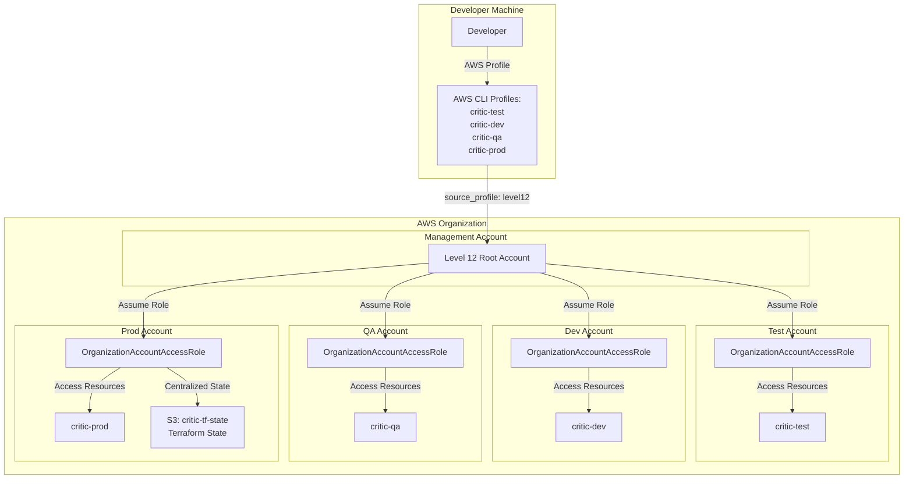
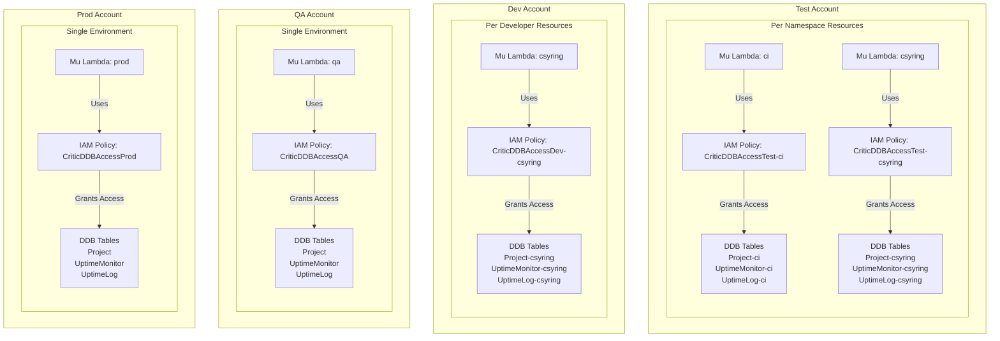

# Infrastructure


## Mu

### Overview
[Mu](https://github.com/level12/mu) manages key infrastructure for lambda-based Python projects, but most AWS resources are outside of Mu's scope. Critic utilizes DynamoDB, for example, so we have to manage that ourselves. We do that with Terraform (see below).

### Granting the Lambda Access
We can grant Mu lambdas access to additional resources outside of Mu's scope by deploying with `policy_arns` in the config.

### Environments
Mu has the concept of "environments," which are simply namespaced Mu resources within the same AWS account. This is designed to support having prod, qa, etc. Mu instances (each of which includes a lambda and related infrastructure) *within the same AWS account.*

We have decided to separate our environments into different AWS accounts, so the only thing we use Mu environments for is namespacing dev resources in our dev and test accounts. For example, each developer should have their own Mu instance in the test account.

### Configs

This project uses several different Mu configs.

Version controlled:
- mu-prod.toml (for the one Mu instance in the prod account)
- mu-qa.toml (for the one Mu instance in the qa account)
- mu-ci.toml (for the Mu instance in the test account that belongs to CI)

Gitignored/per dev:
- mu-dev.toml
- mu-test.toml

This allows developers to tweak their own Mu instances during development without affecting anyone else.


## Terraform

We use [terraform](https://developer.hashicorp.com/terraform) to manage all AWS resources not managed by Mu. This includes:
- IAM roles
- DynamoDB tables
- S3 bucket for state

See the terraform directory.


## AWS Accounts

Three sub/member accounts exist under the Level 12 AWS root/management account:
1. `critic-test` (for integration tests)
2. `critic-dev`
3. `critic-qa`
4. `critic-prod`

Region: `us-east-2`

State: There is one centralized terraform state in an S3 bucket in the critic-prod account.


## Auth

AWS subaccounts are created by default with an IAM role called `OrganizationAccountAccessRole`. The management account can use this IAM role to access resources in the member account:



### Config
Accordingly, your AWS config should look like this:
```
[profile level12]
...
[profile critic-test]
source_profile = level12
role_arn = arn:aws:iam::411307359980:role/OrganizationAccountAccessRole
region = us-east-2
[profile critic-dev]
source_profile = level12
role_arn = arn:aws:iam::492149691130:role/OrganizationAccountAccessRole
region = us-east-2
[profile critic-qa]
source_profile = level12
role_arn = arn:aws:iam::089600762287:role/OrganizationAccountAccessRole
region = us-east-2
[profile critic-prod]
source_profile = level12
role_arn = arn:aws:iam::024984659360:role/OrganizationAccountAccessRole
region = us-east-2
```

env-config is set up to use these AWS profiles based on which env-config profile you activate.

To verify:
- `env-config ci`
- `mu auth-check`
- `mu invoke`

### In the Console
To access a subaccount in the console, go to https://us-east-2.signin.aws.amazon.com/switchrole and enter the applicable account id / role name from the example config above.

## Tables

See architecture.md for details on specific DDB tables.

In the prod and qa environments, only one DDB table should exist for each model (Project, UptimeMonitor, UptimeLog).

In the dev environment, there is a version of each DDB table for each developer, suffixed with their username. For example, `Project-csyring`.

The test environment is the same as dev, except it also has a set of tables for ci.


