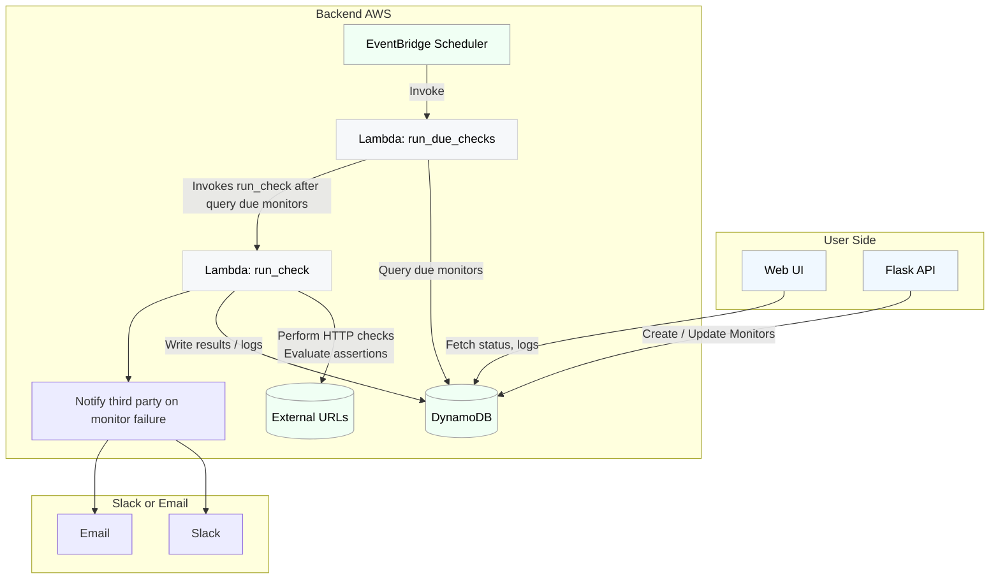

# Model

## Project
- id (partition key, uuid)
- name (str)

## UptimeMonitor
- project_id (partition key, uuid)
- id (sort key, uuid)
- name (str)
- state (new, up, down, paused)
- url (str)
- frequency_mins (can't be more precise because our scheduler runs every minute)
- next_due_at (epoch int, maybe isoformat string for readability)
- timeout_secs (int)
- assertions
  - map of field (response.time, response.code, etc.) to assertion (structure may look very different depending on the field)
  - see cronitor for available fields; each one will need to be built out separately
- failures_before_alerting (int)
- alert_slack_channels (list of str)
- alert_emails (list of str)
- realert_interval_mins (int)

## UptimeLog
- monitor_id (partition key)
- timestamp (sort key, epoch int)
- status (up or down)
- resp_code (int)
- latency_secs (pretty sure all ints are actually floats in ddb, so this could show ms pretty easily)

# Lambda

## Web UI:
- Login (Level 12 oauth)
- Create project
  - User would copy the generated uuid and use that to make the `set_project_monitors` call below
- Delete project
- Dashboard: List monitors by project w/ search
- Monitor page: show config and logs for monitor, (un)pause monitor

## API:
- `set_project_monitors`
  - PUT /project/{project_id}/monitors
  - Structure: {'uptime': [MONITORS], 'job': [MONITORS]} (just uptime for now)
  - View validates monitor types supplied and monitor structure using pydantic
  - Adds new monitors, updates config for existing monitors, deletes missing monitors and their logs
  - Some kind of confirmation for deletion of monitors so that it's explicit
  - Auth: must know the correct project id

## Events (exposed functions called directly, bypassing the Flask API layer, use mu tasks):
- `run_due_checks`
  - Runs once a minute (scheduled in EventBridge)
  - Query all the monitors with `next_due_at` less than or equal to the minute we're running for and status != paused
  - Concurrently `run_check` with each monitor (as a lambda execution)
 - `run_check`
   - make the request
   - check assertions
   - update monitor status
   - add log
   - alert as needed with false assertions (NOT as lambda executions, just python functions, nothing's waiting at this point; but may need to do some queuing/retrying for notification robustness)
   - make sure we respect realert inverval, may need to add another field to do that
   - update `next_due_at` - make sure it's an exact/rounded minute
## Design Flowchart
- Below we can see a diagram that explains how the flask app will interact with the backend. All of the run check calls are performed on the AWS side per the lambda functions. The App only talks to the dynamo ddb via creating monitors or grabbing log information that is store via the lambda functions.

