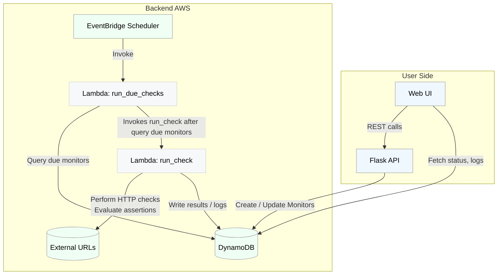

## Design Flowchart
- Below we can see a diagram that explains how the flask app will interact with the backend. All of the run check calls are performed on the AWS side per the lambda functions. The App only talks to the dynamo ddb via creating monitors or grabbing log information that is store via the lambda functions.
